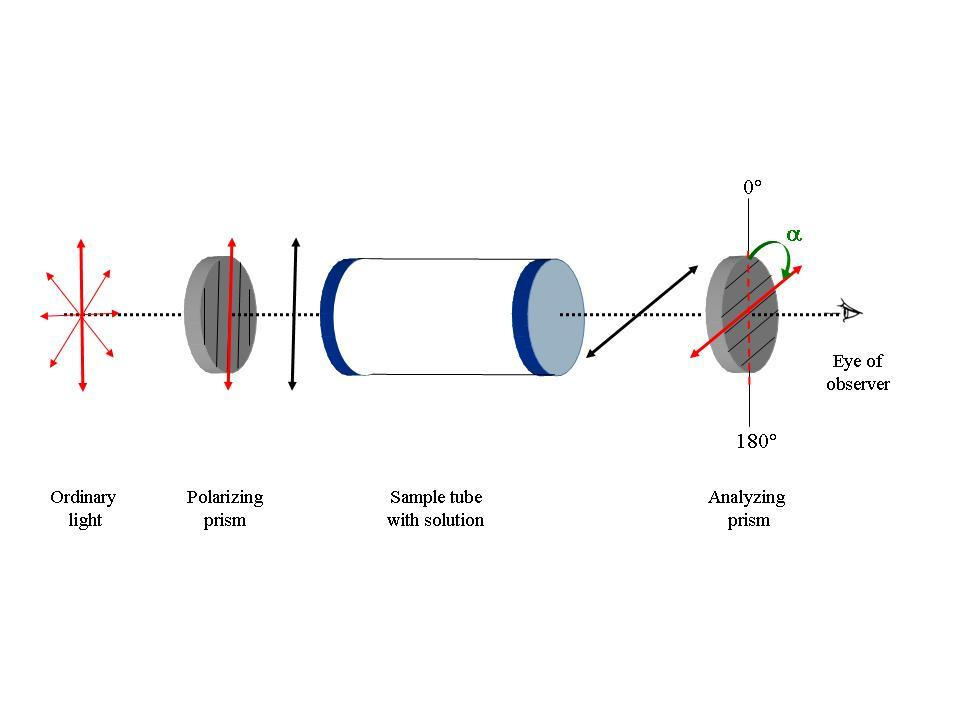

**Chirality and optical activity:**

Chiral molecules have an asymmetrical center which respond to light as a lens and rotate the light. The ability to rotate light is termed optical activity and substances that exhibit this property are called optically active substances. Optically active organic molecules have a spiral structure like a right-handed or left-handed screw. It is this spiral nature of the molecule, which rotates the plane of polarization of light passing through it. Right-handed molecules will rotate the plane of polarization clockwise as viewed in the direction of the beam, while left-handed molecules rotate the plane in a counter clockwise direction. If right-handed and left-handed species of a given molecule occurred with equal abundance, then there would be no net effect on the polarization of light passing through. However, naturally occurring biological molecules of a given species are always either purely right-handed or purely left-handed. However, these enantiomer compounds rotate light by exactly the same amount but in the opposite direction. The degree to which a substance rotates light may be used to determine a) the identity of the substance, b) the enantiomer purity of the substance or c) the concentration of a known substance in a solution. In order to observe rotation, the light which is passed through the solution must be plane polarized. Ordinary light has waves which are oriented in all directions. Plane polarized light is made up of waves which are oriented parallel to a defined plane.

 

When a beam of plane polarized light passes through a solution of optically active material the light will rotate.

This is because, when light interacts with matter, two basic phenomena occur, namely, absorption and the decrease in the velocity of light. Absorption is the decrease in the intensity of light because a part of the incident light is absorbed by the material. The decrease in velocity of light is due to refractive index of the material, because the velocity of light is smaller in the material than in the vacuum.

If the refraction index of the material differs between left and right circularly polarized light, then such materials are shown to exhibit a phenomenon called circular birefringence. Circular birefringence rotates the plane of polarization of the resultant plane-polarized light. This is termed as optical rotation. The angle by which the polarization plane of the light exiting the medium rotates with respect to the original polarization plane is determined by the difference between the refraction indices for the two circularly polarized components (and on the length of path traversed in the medium). Any molecule which exhibits optical rotation or make plane-polarized light elliptically polar is called an optically active material.

**How do chiral molecules exhibit Optical Rotation?**

Interestingly, a monochromatic linearly polarized light beam can be considered as a superposition of two circularly polarized electromagnetic waves that are propagating in the same direction with the same frequency but the opposite sense of rotation. The plane of polarization of the resulting linearly polarized wave thus prepared can be changed (rotated) by applying a phase shift between its two circularly polarized components. With the help of this concept we can explain the phenomenon of optical rotation: We have seen that chiral molecules interact slightly differently with the two circularly polarized components of a linearly polarized light beam. This is true both for absorption and refraction. Left- and right hand circularly polarized light beams also have slightly different refractive indices in a chiral medium. This means that even if they are not absorbed they travel at different speeds through the medium. Therefore, this causes a phase shift between the two circularly polarized components which increases proportional to the path length that the light travels through the chiral medium. This phase shift manifests itself as a rotation of the plane of polarization of the resultant linearly polarized light beam - optical rotation.

The degree of rotation of the plane polarized light depends on the wavelength of the light (usually, the yellow sodium D line near 589 nm wavelength is used), the optical path length, the concentration of the solution, and the chemistry of the molecule. Under identical conditions, some molecules rotate polarized light more than the others do. In order measure how good chiral molecules rotate plane- polarized light, a term called as the "specific rotation" was coined. The specific rotation of a substance is an intrinsic characteristic similar to other properties such melting point, or solubility. By convention, the specific rotation of a chemical is defined as the observed rotation when light of a specified wavelength passes through sample path length of one decimeter (1 dm = 10 cm) and a sample concentration of 1 g/mL.

**Circular birefringence and optical rotation**

Chiral molecules exhibit circular birefringence, which means that a solution of a chiral substance presents an anisotropic medium through which left circularly polarised (L-CPL) and right circularly polarised (R-CPL) propagate at different speeds. A linearly polarised wave can be thought of as the resultant of the superposition of two circularly polarised waves, one left-circularly polarised, the other right-circularly polarised. On traversing the circularly birefringent medium, the phase relationship between the circularly polarised waves changes and the resultant linearly polarised wave rotates. This is the origin of the phenomenon known as optical rotation, which is measured using a polarimeter. Measuring optical rotation as a function of wavelength is termed optical rotatory dispersion (ORD) spectroscopy.

 

Circular birefringence:the orange cuboid represents the sample

For pure liquids:

[α]Tλ = α/(l * d)

In this equation,

l is the path length in decimeters

d is the density of the liquid in g/mL for a sample at a

temperature T (given in degrees Celsius) and wavelength λ (in nanometers).

If the wavelength of the light used is 589 nanometer (the sodium D line), the symbol “D” is used. The sign of the rotation (+ or -) is always given.

For solutions, a different equation is used:

[α]Tλ = 100 * α/(l * c)

In this equation,

l is the path length in decimeters

c is the concentration in g/100mL for a sample at a

temperature T (given in degrees Celsius) and wavelength λ (in nanometers).

When using this equation, the concentration and the solvent are always provided in parentheses after the rotation. The rotation is reported using degrees, and no units of concentration are given (it is assumed to be g/100mL).

**Functioning of the polarimeter**

a

b

**Fig. 1:** Schematic representation of the functioning of the polarimeter.

**a.** When the sample tube is empty, the planes of polarization of the polarizing and the analyzing prisms are same and αobs is 0°

**b.** When the sample tube has a solution of a chiral (optically active) substance, the plane of polarization of the emergent polarized light changes. One now needs to rotate the analyzer prism for its plane of polarization to coincide with the plane of the emergent light. This corresponds to the maximum intensity of the transmitted light. The αobs is shown with a green arrow.
